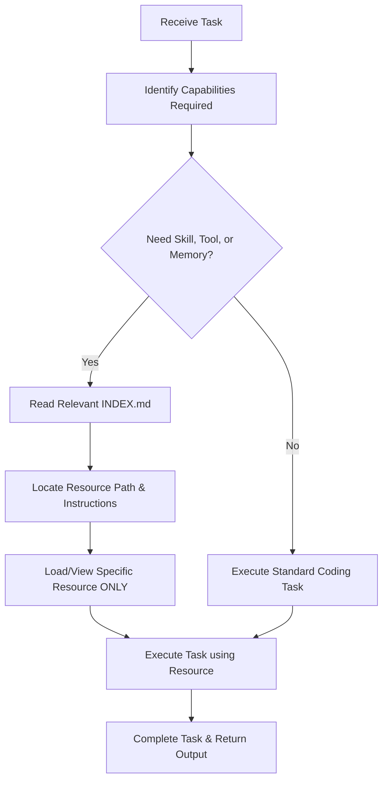

# Agent Guidelines & JIT Progressive Disclosure System


Welcome, Agent. This workspace is configured using a **Just-in-Time (JIT) Progressive Disclosure System**. To optimize context window usage and prevent prompt clutter, you must **not** load or read all skills, tools, and memories upfront.

Instead, follow the JIT protocol outlined below to discover and access resources dynamically when needed.

---

## 🧭 The JIT Protocol (Step-by-Step)

When you receive a task or prompt, follow this workflow:



1. **Assess the Task**: Analyze the user's request. Identify if it requires domain-specific skills, custom scripting tools, or workspace memory/knowledge context.
2. **Consult the Index**: Instead of running broad searches or viewing multiple files, check the relevant folder's `INDEX.md` catalog:
   - For modular workflows/specialties: [agent/skills/INDEX.md](file:///Users/bobhuff/ProgressiveTools/agent/skills/INDEX.md)
   - For CLI/script utilities: [agent/tools/INDEX.md](file:///Users/bobhuff/ProgressiveTools/agent/tools/INDEX.md)
   - For architectural guides and historical logs: [agent/memories/INDEX.md](file:///Users/bobhuff/ProgressiveTools/agent/memories/INDEX.md)
3. **Targeted Read**: Open and read **only** the specific file or folder mapped by the index. Do not recursively scan folders or read files that are outside the scope of your current step.
4. **Execute**: Perform the task following the instructions in the newly discovered resource.
5. **Clean Up**: Ensure that you do not unnecessarily inject unrelated files or documents into your conversation context for subsequent steps.

---

## 📂 Directory Layout

The `agent/` folder in the root contains all JIT resources:

```
agent/
├── skills/           # Custom capabilities/workflows (must contain SKILL.md)
│   └── INDEX.md      # Map of all available skills
├── tools/            # Local developer tools, helper scripts, and CLI utilities
│   └── INDEX.md      # Map of all custom tools and run commands
└── memories/         # Workspace knowledge base, design documents, and logs
    └── INDEX.md      # Map of all design and history documents
```

---

## 🛠 Rules of Engagement

- ❌ **No upfront scans**: Do not list directory trees recursively or grep globally unless explicitly required to search for a code symbol.
- ❌ **No massive imports**: When instantiating local agents using the SDK, do not add all skill folders to `skills_paths` in `LocalAgentConfig`. Keep it empty or limited, and read files via file tools.
- 🎯 **Targeted search**: If the `INDEX.md` files do not list what you need, use a specific, narrow `grep_search` or `find_file` query rather than a wildcard scan.
- 📝 **Maintain the Index**: If you create a new skill, tool, or memory file, you **must** update the corresponding `INDEX.md` file immediately so future agents can discover it.
