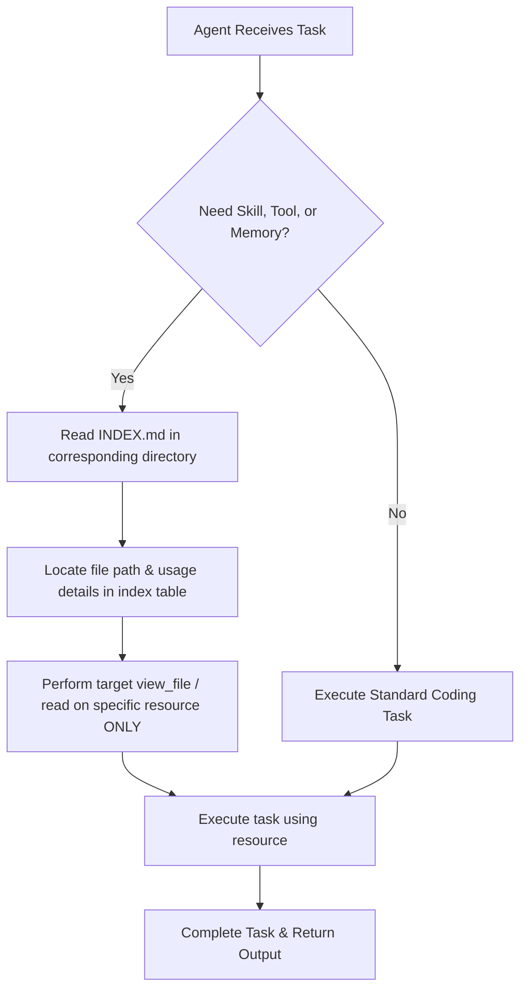

# Progressive Tools: JIT Agent Progressive Disclosure Environment


This workspace is designed to test and demonstrate **Just-in-Time (JIT) Progressive Disclosure** for AI coding agents. 

Rather than pre-loading all tools, skills, and memory contexts upfront (which bloats the context window and triggers prompt-limit issues), this system registers only core navigation utilities. Incoming agents are instructed to search and load specific catalogs dynamically.

---

## 🧭 System Philosophy

1. **Context Efficiency**: Keep the initial agent system prompt clean and minimal.
2. **Search-On-Demand**: The agent searches directories when tasks require specific expertise.
3. **Strict Catalogs**: Every category of capabilities (`skills`, `tools`, `memories`) is tracked in an `INDEX.md` file that acts as a lightweight catalog query target.

---

## 🧭 How It Works (JIT Agent Flow)



---

## 📂 Project Directory Structure

```
ProgressiveTools/
├── AGENTS.md                  # Manual detailing JIT protocols for agents.
├── README.md                  # Project overview and developer instructions.
├── test_code.py               # Sample Python code used for tool verification.
└── agent/
    ├── bootstrap_example.py   # Bootstraps the SDK Agent with the JIT setup.
    ├── memories/
    │   ├── INDEX.md           # Catalog indexing doc files.
    │   └── workspace_overview.md
    ├── skills/
    │   ├── INDEX.md           # Catalog indexing skill workflows.
    │   ├── example_skill/
    │   │   └── SKILL.md       # Placeholder example skill instructions.
    │   └── code_quality/
    │       └── SKILL.md       # Custom JIT code quality check workflow.
    └── tools/
        ├── INDEX.md           # Catalog indexing local CLI developer tools.
        ├── example_tool.py    # Greeting CLI helper tool.
        └── lint_runner.py     # Custom AST syntax/docstring check utility.
```

---

## 🔍 Catalog Quick Access

Incoming agents can inspect the following indexes to dynamically discover capabilities:
* 🛠 **Skills Catalog**: [agent/skills/INDEX.md](file:///Users/bobhuff/ProgressiveTools/agent/skills/INDEX.md) — For workflow-specific guidelines.
* ⚙️ **Tools Catalog**: [agent/tools/INDEX.md](file:///Users/bobhuff/ProgressiveTools/agent/tools/INDEX.md) — For executable CLI utility scripts.
* 📚 **Memories Catalog**: [agent/memories/INDEX.md](file:///Users/bobhuff/ProgressiveTools/agent/memories/INDEX.md) — For architectural notes and knowledge resources.

---

## 🚀 How to Run and Test

### 1. Bootstrapping a JIT Agent
The script [agent/bootstrap_example.py](file:///Users/bobhuff/ProgressiveTools/agent/bootstrap_example.py) shows how to initialize `LocalAgentConfig` with:
- Zero upfront skill paths.
- Core directory navigation permissions (allowed `view_file`, `list_directory`, and `search_directory`).
- Prompt redirection instructions pointing to the [AGENTS.md](file:///Users/bobhuff/ProgressiveTools/AGENTS.md) guide.

### 2. Testing Custom Tools
The `lint_runner.py` tool analyses python files. You can test it by running:
```bash
python3 agent/tools/lint_runner.py --file test_code.py
```

It parses the Python AST to ensure valid syntax and outputs a report detailing functions or methods missing documentation strings.

---

## 🆕 Extending the System

To maintain the JIT architecture, always update the appropriate index after adding resources:
1. **Adding a Skill**: Create a subfolder in `agent/skills/` with a `SKILL.md` instruction set. Register it in [agent/skills/INDEX.md](file:///Users/bobhuff/ProgressiveTools/agent/skills/INDEX.md).
2. **Adding a Tool**: Put the executable/script in `agent/tools/`. Register the parameters and expected outputs in [agent/tools/INDEX.md](file:///Users/bobhuff/ProgressiveTools/agent/tools/INDEX.md).
3. **Adding a Memory**: Create a document in `agent/memories/`. Register it in [agent/memories/INDEX.md](file:///Users/bobhuff/ProgressiveTools/agent/memories/INDEX.md).
